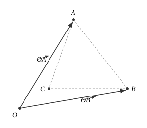
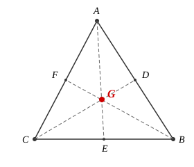
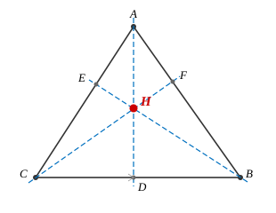
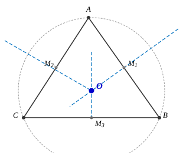
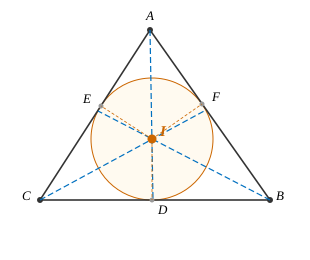

# 向量与三角形

??? abstract
    向量与三角形的综合问题在高考中常以中档题形式出现，本讲系统整理向量背景下三角形的面积公式与五心（重心、垂心、外心、内心）的向量性质。

## 一、三角形面积公式

### 1\. 基本公式

设 \(O\) 为坐标原点，\(A\)、\(B\)、\(C\) 为三角形三个顶点，则 \(\triangle ABC\) 的面积为：

\[
S = \frac{1}{2} |\vec{OA} \times \vec{OB}|
\]

### 2\. 迁移：三点都不在原点的情形

若三点都不在原点，则有：

\[
S = \frac{\sqrt{|\vec{OA}|^2 \cdot |\vec{OB}|^2 - |\vec{OA} \cdot \vec{OB}|^2}}{2}  \tag{1}
\]

若 \(\vec{OA} = (x_1, y_1)\)，\(\vec{OB} = (x_2, y_2)\)，则：

\[
S = \frac{1}{2} |x_1 y_2 - x_2 y_1|  \tag{2}
\]

??? tip
    证略，由向量叉积的几何意义可得。

## 二、三角形五心

### 1\. 重心（中线交点）

**性质**：

① 重心将每条中线分为 \(2:1\)（从顶点到对边中点），即：

\[
\frac{AG}{GE} = \frac{BG}{GF} = \frac{CG}{GD} = 2
\]

② 若 \(A(x_1, y_1)\)，\(B(x_2, y_2)\)，\(C(x_3, y_3)\)，则：

\[
G\left(\frac{x_1 + x_2 + x_3}{3}, \frac{y_1 + y_2 + y_3}{3}\right)
\]

③ 重心将三角形面积三等分：

\[
S_{\triangle ABG} = S_{\triangle BGC} = S_{\triangle AGC}
\]

④ ★ \(G\) 点满足 \(GA^2 + GB^2 + GC^2\) 最小（即当 \(G\) 在平面内任一点处时，\(TA^2 + TB^2 + TC^2\) 最小时，\(T\) 即为重心）。

**向量性质**：

\[
\vec{GA} + \vec{GB} + \vec{GC} = \vec{0}  \tag{3}
\]

★ 若 \(\vec{AP} = \lambda \left(\frac{\vec{AB}}{|AB| \sin B} + \frac{\vec{AC}}{|AC| \sin C}\right)\)，则 \(A\)、\(P\)、\(G\) 三点共线。

**例题**：

若 \(\vec{AB} = m\vec{AM}\)，\(\vec{AC} = n\vec{AN}\)，\(M\)、\(N\) 分别在 \(AB\)、\(AC\) 上，且 \(MN\) 过 \(G\) 点，则 \(m + n = 3\)。

??? tip
    证明：设 \(A(x_1, y_1)\)，\(B(x_2, y_2)\)，\(C(x_3, y_3)\)，则 \(G\left(\frac{x_1+x_2+x_3}{3}, \frac{y_1+y_2+y_3}{3}\right)\)。

    由 \(M\) 在 \(AB\) 上，\(N\) 在 \(AC\) 上，且 \(MN\) 过 \(G\)，利用共线条件可得 \(m + n = 3\)。

### 2\. 垂心（高线交点）

**性质**：

① \(\triangle AHC\) 垂心为 \(B\)（及另外两个同理）。

② 在锐角三角形中：

\[
BH \cdot HE = CH \cdot HF = AH \cdot HD  \tag{4}
\]

（即交弦定理）

★ 若 \(\tan A \cdot \overrightarrow{HA} = \tan B \cdot \overrightarrow{HB} = \tan C \cdot \overrightarrow{HC}\)，则 \(H\) 为垂心。

③ 若 \(H\) 为垂心，则：

\[
\overrightarrow{AH} = \lambda \left(\frac{\overrightarrow{AB}}{|AB| \cos B} + \frac{\overrightarrow{AC}}{|AC| \cos C}\right)  \tag{5}
\]

??? tip
    证明：

    \[
    \overrightarrow{AP} \cdot \overrightarrow{BC} = \lambda \left(\frac{\overrightarrow{AB} \cdot \overrightarrow{BC}}{|AB| \cos B} + \frac{\overrightarrow{AC} \cdot \overrightarrow{BC}}{|AC| \cos C}\right)
    \]

    \[
    = \lambda \left(\frac{-DB \cdot BC}{|AB| \cos B} + \frac{BC \cdot DC}{|AC| \cos C}\right)
    \]

    \[
    = \lambda \cdot BC \cdot (-1 + 1) = 0
    \]

    \(\therefore AP \perp BC\)

### 3\. 外心（中垂线交点）

**性质**：

① \(\angle BOC = 2\angle BAC\)（及另外两个同理）。

② ★ 若 \(\sin 2A \cdot \overrightarrow{OA} + \sin 2B \cdot \overrightarrow{OB} + \sin 2C \cdot \overrightarrow{OC} = \vec{0}\)（奔驰定理），则 \(O\) 为外心。

③ \(O\)、\(G\)、\(H\)（外、重、重心）三点共线，且 \(HG = 2GO\)（欧拉线）。

??? tip
    证明：由奔驰定理：

    \[
    S_{\triangle OBC} \cdot \overrightarrow{OA} + S_{\triangle OAC} \cdot \overrightarrow{OB} + S_{\triangle OAB} \cdot \overrightarrow{OC} = \vec{0}
    \]

    \[
    \Rightarrow \frac{1}{2}R^2 \sin 2A \cdot \overrightarrow{OA} + \frac{1}{2}R^2 \sin 2B \cdot \overrightarrow{OB} + \frac{1}{2}R^2 \sin 2C \cdot \overrightarrow{OC} = \vec{0}
    \]

    \(\therefore\) Q.E.D.

④ 若 \(|\overrightarrow{OA}| = |\overrightarrow{OB}| = |\overrightarrow{OC}|\)，则 \(O\) 为外心。

⑤ 若 \(\overrightarrow{OP} = \frac{\overrightarrow{OB} + \overrightarrow{OC}}{2} + \lambda \frac{\overrightarrow{AB}}{|AB| \cos B}\)，则 \(P\) 轨迹过外心。

### 4\. 内心（内角平分线交点）

**性质**：

① 若 \(a \cdot \overrightarrow{IA} + b \cdot \overrightarrow{IB} + c \cdot \overrightarrow{IC} = \vec{0}\)，则 \(I\) 为内心（其中 \(a\)、\(b\)、\(c\) 为对应边长）。

② \(AD^2 = AB \cdot AC - BD \cdot DC\)（斯特瓦尔特定理）。

③ ★ \(\frac{1}{2}AB \cdot AD \cdot \sin \alpha + \frac{1}{2}AC \cdot AD \cdot \sin \beta = \frac{1}{2}AB \cdot AC \cdot \sin(\alpha + \beta)\)

??? tip
    证明：

    \[
    \Rightarrow \frac{\sin \alpha}{AC} + \frac{\sin \beta}{AB} = \frac{\sin(\alpha + \beta)}{AD} \quad \text{（张角定理）}
    \]

④ 若 \(a = b\)，则 \(\frac{1}{AC} + \frac{1}{AB} = \frac{2 \cos \frac{\alpha}{2}}{AD}\)。

⑤ \(r = \frac{2S}{C}\)（内切圆半径 \(r\) 与面积 \(S\)、周长 \(C\) 的关系）。

⑥ 若 \(\overrightarrow{AP} = \lambda \left(\frac{\overrightarrow{AB}}{|AB|} + \frac{\overrightarrow{AC}}{|AC|}\right)\)，则 \(A\)、\(P\)、\(I\) 三点共线（即 \(AP\) 过内心）。
