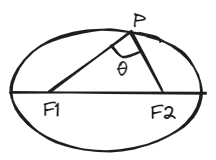
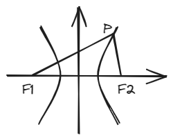
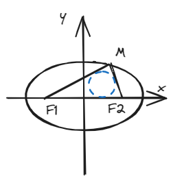

# 结论一：焦点三角形面积公式

## 一、结论描述

如图，在椭圆上有一点\(P \)，\(\angle F_1 PF_2 = \theta \)，\(F_1 \) 、\(F_2 \)为焦点，则\(S_{\Delta PF_1 F_2} = b^2 \tan \frac{\theta}{2} \)。

如图，在双曲线上有一点\(P \)，\(\angle F_1 PF_2 = \theta \)，\(F_1 \) 、\(F_2 \)为焦点，则\(S_{\Delta PF_1 F_2} = b^2 \cot \frac{\theta}{2} \)。

## 二、结论证明

此处仅以椭圆（水平放置）为例进行证明，其他情况思路类似。

由面积公式：

\[
S_{\Delta PF_1F_2} = \frac{1}{2} |PF_1||PF_2|\sin \theta  \tag{1}
\]

由余弦定理：

\[
|PF_1|^2 + |PF_2|^2 - |F_1F_2|^2 = 2|PF_1||PF_2|\cos \theta \tag{2}  
\]

\( (2) \)式左右同时加上\( 2|PF_1||PF_2| \)可得：

\[
(2a)^2 - (2c)^2 = 2|PF_1||PF_2|(\cos \theta + 1) \tag{3}
\]

由此可得\(|PF_1||PF_2| \)为：

\[
|PF_1||PF_2| = \frac{2b^2}{1+\cos \theta} \tag{4}
\]

\( (4) \)式带入\( (1) \)式，同时三角函数变换一下可得：

\[
S_{\Delta F_1PF_2} = b^2 \frac{\sin}{1+\cos \theta} = b^2 \tan \frac{\theta}{2} \tag{5}
\]

## 三、例题

椭圆方程：\( \frac{x^2}{4}+\frac{y^2}{3}=1\)，\(P \)是椭圆上一点，\(F_{1} \)，\(F_{2} \)是椭圆的左右焦点，且\( \angle F_{1}PF_{2}=45° \)，则\(\bigtriangleup PF_{1}F_{2} \)的内切圆半径\(r=\_\_\_\_\_ \)

## 四、拓展结论

**结论1**：椭圆上一点与两焦点所成角度（即\(\angle F_1PF_2 \)）中有一个最大值，在上下顶点处取到这个最大值（此处仅考虑水平放置的椭圆）。 
证明：
由\((4)\)式可得：

\[
\cos \theta = \frac{2b^2}{|PF_1||PF_2|} - 1 \tag{6}
\]

又由均值不等式可得：

\[
|PF_1||PF_2| \le (\frac{|PF_1|+|PF_2|}{2})^2 = a^2 \tag{7}
\]

\((7)\)式在二者相等时取等
即\(|PF_1|=|PF_2| \)时\(\theta \)取到最大值

**结论2**:在椭圆中，\(|PF_1||PF_2|= \frac{2b^2}{1+\cos \theta}\)；在双曲线中，\(|PF_1||PF_2|= \frac{2b^2}{1-\cos \theta}\)。 
证略，请见\((4)\)式