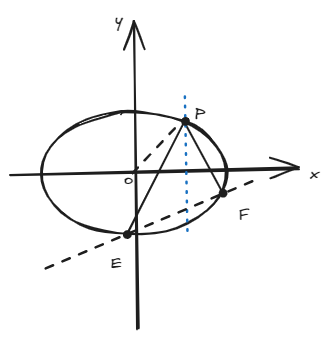

# 结论十一：椭圆上定点关于两动点斜率对称性的定值问题

??? abstract
    实际上这是”齐次化“方法很经典的可证结论之一，也是一个偶尔出现大题的结论，它考察得很基础又很进阶。

## 一、结论描述

设椭圆的标准方程为： 

- **焦点在x轴**：$\dfrac{x^2}{a^2} + \dfrac{y^2}{b^2} = 1$  
- **焦点在y轴**：$\dfrac{x^2}{b^2} + \dfrac{y^2}{a^2} = 1$  

已知点$P$为椭圆上的定点，动点$E,F$在椭圆上且满足$k_{PE} + k_{PF} = 0$（即$PE$与$PF$的斜率互为相反数），则：  
1. **$EF$的斜率$k_{EF}$为定值**；  
2. **$k_{EF} \cdot k_{PO} = \dfrac{b^2}{a^2}$（焦点在x轴）或$\dfrac{a^2}{b^2}$（焦点在y轴）**，其中$O$为原点。

## 二、结论证明

此处以焦点在x轴的情形为例。

**椭圆方程**：$\dfrac{x^2}{a^2} + \dfrac{y^2}{b^2} = 1$

**平移坐标系**：以定点\$P(x_0, y_0)\$为新原点，平移后新坐标为：

\[
x = x + x_0, \quad y = y + y_0
\]

**椭圆方程变换**：代入原椭圆方程得：

\[
\frac{(x+x_0)^2}{a^2} + \frac{(y+y_0)^2}{b^2} = 1
\]

将方程(2)改写为$1 = mx + ny$，代入方程(1)的**一次项**中实现齐次化：  

\[
\frac{x^2}{a^2} + \frac{y^2}{b^2} + \left( \frac{2x_0}{a^2}x + \frac{2y_0}{b^2}y \right)(mx + ny) = 0
\]  

展开后得**齐次二次方程**：  

\[
\frac{x^2}{a^2} + \frac{y^2}{b^2} + \frac{2x_0 m}{a^2}x^2 + \frac{2x_0 n}{a^2}xy + \frac{2y_0 m}{b^2}xy + \frac{2y_0 n}{b^2}y^2 = 0
\]  

整理合并同类项：  

\[
\left( \frac{1}{a^2} + \frac{2x_0 m}{a^2} \right)x^2 + \left( \frac{2x_0 n}{a^2} + \frac{2y_0 m}{b^2} \right)xy + \left( \frac{1}{b^2} + \frac{2y_0 n}{b^2} \right)y^2 = 0 \quad \text{(3)}
\]
 
令斜率$k = \dfrac{y}{x}$，将方程(3)两边除以$x^2$得：  

\[
\left( \frac{1}{a^2} + \frac{2x_0 m}{a^2} \right) + \left( \frac{2x_0 n}{a^2} + \frac{2y_0 m}{b^2} \right)k + \left( \frac{1}{b^2} + \frac{2y_0 n}{b^2} \right)k^2 = 0
\]   

设$E(x_1, y_1)$、$F(x_2, y_2)$对应斜率$k_1, k_2$，由$k_{PE} + k_{PF} = 0$即$k_1 + k_2 = 0$。根据韦达定理：  

\[
k_1 + k_2 = -\frac{\frac{2x_0 n}{a^2} + \frac{2y_0 m}{b^2}}{\frac{1}{b^2} + \frac{2y_0 n}{b^2}} = 0
\]  

解得：  

\[
\frac{2x_0 n}{a^2} + \frac{2y_0 m}{b^2} = 0 \quad \Rightarrow \quad \frac{x_0 n}{a^2} = -\frac{y_0 m}{b^2} \quad \text{(4)}
\]
  
直线$EF$的斜率$k_{EF}$在平移后为$k'_{EF} = -\dfrac{m}{n}$。由方程(4)：  

\[
\frac{x_0}{a^2}n = -\frac{y_0}{b^2}m \quad \Rightarrow \quad \frac{m}{n} = -\frac{b^2 x_0}{a^2 y_0}
\]  

故$k'_{EF} = \dfrac{b^2 x_0}{a^2 y_0}$。还原到原坐标系，斜率不变，即：  

\[
k_{EF} = \frac{b^2 x_0}{a^2 y_0}
\]  

结合$k_{PO} = \dfrac{y_0}{x_0}$，得：  

\[
k_{EF} \cdot k_{PO} = \frac{b^2}{a^2}
\]

## 三、例题

椭圆$C: \dfrac{x^2}{4} + y^2 = 1$，定点$P(1, \dfrac{\sqrt{3}}{2})$，动点$E,F$在椭圆上且$k_{PE} + k_{PF} = 0$，求$EF$的斜率为\_\_\_\_\_\_\_\_。

**解**：  
椭圆参数：$a=2$, $b=1$（焦点在x轴）  
计算$k_{PO}$：

$$
   k_{PO} = \frac{\sqrt{3}/2}{1} = \frac{\sqrt{3}}{2}
$$  

应用结论：

$$
   k_{EF} \cdot \frac{\sqrt{3}}{2} = \frac{1^2}{2^2} = \frac{1}{4} \quad \Rightarrow \quad k_{EF} = \frac{1}{4} \div \frac{\sqrt{3}}{2} = \frac{\sqrt{3}}{6}
$$

**答案**：$k_{EF} = \boxed{\dfrac{\sqrt{3}}{6}}$

??? note
    大题请写明推导证明过程，否则几乎拿不到分数。

## 四、拓展结论

**逆命题**：若$EF$斜率为定值且满足$k_{EF} \cdot k_{PO} = \dfrac{b^2}{a^2}$，则存在$E,F$使得$k_{PE} + k_{PF} = 0$。  
**双曲线类比**：对双曲线$\dfrac{x^2}{a^2} - \dfrac{y^2}{b^2} = 1$，类似条件可得：

$$
   k_{EF} \cdot k_{PO} = -\dfrac{b^2}{a^2}或-\dfrac{a^2}{b^2}
$$  

**抛物线类比**：  

- 焦点在x轴上的抛物线：$y^2 = 2px$，定点$P(x_0, y_0)$在抛物线上，若$k_{PE} + k_{PF} = 0$，则$k_{EF} \cdot y_0 = -p$；  
- 焦点在y轴上的抛物线：$x^2 = 2py$，定点$P(x_0, y_0)$在抛物线上，若$k_{PE} + k_{PF} = 0$，则$\dfrac{x_0}{k_{EF}} = -p$。