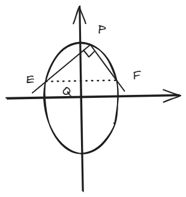
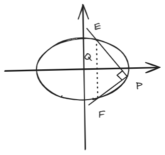

# 结论十二：椭圆上定点关于两动点直线垂直的定点问题

??? Abstract
    这个结论是齐次化的另一个经典例子。
    
    两动点与定点构成的垂直的直线，过一个定点。

## 一、结论描述

**焦点在x轴**：标准方程为  

\[
   \frac{x^2}{a^2} + \frac{y^2}{b^2} = 1 \quad (a > b)
\]  

定点\( P(x_0, y_0) \)在椭圆上，若\( PE \perp PF \)（\( k_{PE} \cdot k_{PF} = -1 \)），则直线\( EF \)恒过定点： 

\[
   Q\left( \frac{a^2 - b^2}{a^2 + b^2}x_0, \ -\frac{a^2 - b^2}{a^2 + b^2}y_0 \right)
\]

**焦点在y轴**：标准方程为  

\[
   \frac{x^2}{b^2} + \frac{y^2}{a^2} = 1 \quad (a > b)
\]  

定点\( P(x_0, y_0) \)在椭圆上，若\( PE \perp PF \)（\( k_{PE} \cdot k_{PF} = -1 \)），则直线\( EF \)恒过定点：

\[
   Q\left( -\frac{a^2 - b^2}{a^2 + b^2}x_0, \ \frac{a^2 - b^2}{a^2 + b^2}y_0 \right)
\]

特别地，当椭圆为圆（\( a = b \)）时，\( Q \)与原点\( O \)重合。

??? tip
    老实说，这个结论我记不住，但是有齐次化思路不影响我在考场上临时计算。

    这种结论一般是作为大题出现（如果出现为小题反而丧失了这套题的含金量，“大题改小题”这种纯吃人计算能力而拖延考生时间的例子我是不赞同的捏）。

## 二、结论证明（齐次化方法）

以\( P(x_0, y_0) \)为原点平移坐标系，设新坐标为\( (x,y) \)，则：  

\[
x = x + x_0, \quad y = y + y_0
\]  

椭圆方程变换为：  

\[
\frac{(x + x_0)^2}{a^2} + \frac{(y + y_0)^2}{b^2} = 1
\]  

展开后利用\( \frac{x_0^2}{a^2} + \frac{y_0^2}{b^2} = 1 \)消去常数项，得：  

\[
\frac{x^2}{a^2} + \frac{y^2}{b^2} + \frac{2x_0 x}{a^2} + \frac{2y_0 y}{b^2} = 0 \quad \text{(1)}
\]  

设平移后直线\( EF \)的方程为：  

\[
mx + ny = 1 \quad \text{(2)}
\]  

将方程(1)的**一次项**替换为方程(2)的倍数以实现齐次化：  

\[
\frac{x^2}{a^2} + \frac{y^2}{b^2} + \left( \frac{2x_0}{a^2}x + \frac{2y_0}{b^2}y \right)(mx + ny) = 0
\]  

展开并整理为齐次二次方程：  

\[
\left( \frac{1}{a^2} + \frac{2x_0 m}{a^2} \right)x^2 + \left( \frac{2x_0 n}{a^2} + \frac{2y_0 m}{b^2} \right)xy + \left( \frac{1}{b^2} + \frac{2y_0 n}{b^2} \right)y^2 = 0
\]  

令\( k = \frac{y}{x} \)，方程两边除以\( x^2 \)得：  

\[
\left( \frac{1}{a^2} + \frac{2x_0 m}{a^2} \right) + \left( \frac{2x_0 n}{a^2} + \frac{2y_0 m}{b^2} \right)k + \left( \frac{1}{b^2} + \frac{2y_0 n}{b^2} \right)k^2 = 0
\]  

由\( k_1 k_2 = -1 \)（\( PE \perp PF \)），根据韦达定理：  

\[
k_1 k_2 = \frac{\frac{1}{a^2} + \frac{2x_0 m}{a^2}}{\frac{1}{b^2} + \frac{2y_0 n}{b^2}} = -1
\]  

化简得约束条件：  

\[
\frac{1 + 2x_0 m}{a^2} = -\frac{1 + 2y_0 n}{b^2} \quad \text{(3)}
\]  

解得：    

\[
Q\left( \frac{a^2 - b^2}{a^2 + b^2}x_0, \ -\frac{a^2 - b^2}{a^2 + b^2}y_0 \right)
\]  

## 三、例题

**题目**：椭圆\( C: \dfrac{x^2}{4} + y^2 = 1 \)，定点\( P(1, \dfrac{\sqrt{3}}{2}) \)，求满足\( PE \perp PF \)的直线\( EF \)所过定点\( Q \)。

**解**：  

**椭圆参数**：\( a=2 \), \( b=1 \)，代入定点坐标公式：  

\[
Q\left( \frac{4 - 1}{4 + 1} \cdot 1, \ -\frac{4 - 1}{4 + 1} \cdot \frac{\sqrt{3}}{2} \right) = \left( \frac{3}{5}, \ -\frac{3\sqrt{3}}{10} \right)
\]  

**答案**：  

\[
\boxed{Q\left( \dfrac{3}{5}, -\dfrac{3\sqrt{3}}{10} \right)}
\]  

??? tip
    这种题有一种方法，叫特殊值法：带两组值进行计算，分别得到两条直线，算交点即可。

## 四、拓展结论

### 类比一：双曲线情形
**焦点在x轴**：标准方程为  

\[
   \frac{x^2}{a^2} - \frac{y^2}{b^2} = 1
\]  

   定点\( P(x_0, y_0) \)在双曲线上，若\( PE \perp PF \)，则直线\( EF \)恒过定点：  

\[
   Q\left( \frac{a^2 + b^2}{a^2 - b^2}x_0, \ \frac{a^2 + b^2}{a^2 - b^2}y_0 \right)
\]

**焦点在y轴**：标准方程为 

\[
   \frac{y^2}{a^2} - \frac{x^2}{b^2} = 1
\]  

   定点\( P(x_0, y_0) \)在双曲线上，若\( PE \perp PF \)，则直线\( EF \)恒过定点：  

\[
   Q\left( -\frac{a^2 + b^2}{a^2 - b^2}x_0, \ \frac{a^2 + b^2}{a^2 - b^2}y_0 \right)
\]

### 类比二：抛物线情形
**开口向右**：标准方程为\( y^2 = 4px \)，定点\( P(x_0, y_0) \)在抛物线上，若\( PE \perp PF \)，则直线\( EF \)恒过定点：

\[
   Q(x_0 + 4p, -y_0)
\]

**开口向左**：标准方程为\( y^2 = -4px \)，定点\( P(x_0, y_0) \)在抛物线上，则定点为：  

\[
   Q(x_0 - 4p, -y_0)
\]

**开口向上**：标准方程为\( x^2 = 4py \)，定点\( P(x_0, y_0) \)在抛物线上，则定点为：  

\[
   Q(-x_0, y_0 + 4p)
\]

**开口向下**：标准方程为\( x^2 = -4py \)，定点\( P(x_0, y_0) \)在抛物线上，则定点为：

\[
   Q(-x_0, y_0 - 4p)
\]

### 推论一

\( k_{PE} \cdot k_{PF} = r\,\) （\(r\)为定值）的情况下仍然可以得到EF过定点的结论，具体思路和上述证明过程类似，只不过把-1换掉即可。

??? tip
    这也是我不推荐背这个结论而只记住思路的原因，毕竟换个r又要出重新去记忆...

### 推论二

在[一、结论描述](#一结论描述)的条件下，$Q$坐标只与离心率$e$和定点$P$坐标有关。

**证明：**

以焦点在x轴的椭圆为例，我们已知\( Q \)的坐标为：  

\[
Q\left( \frac{a^2 - b^2}{a^2 + b^2}x_0, \ -\frac{a^2 - b^2}{a^2 + b^2}y_0 \right)
\]  

将\( b^2 = a^2(1 - e^2) \)代入分子和分母：  

\[
\frac{a^2 - b^2}{a^2 + b^2} = \frac{a^2 - a^2(1 - e^2)}{a^2 + a^2(1 - e^2)} = \frac{a^2 e^2}{a^2(2 - e^2)} = \frac{e^2}{2 - e^2}
\]  

因此，\( Q \)的坐标可改写为：  

\[
Q\left( \frac{e^2}{2 - e^2}x_0, \ -\frac{e^2}{2 - e^2}y_0 \right)
\]  

显而易见，其实这也说明了定点\( Q \)为\( P \)关于椭圆中心的**调和共轭点**，缩放比例由离心率决定。