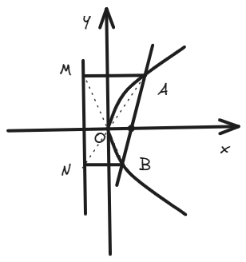
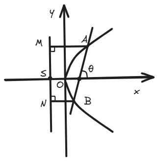

# 结论十三：过焦点直线的坐标关系结论

??? abstract

    这一结论会经常使用，它简化了**过焦点直线**与**圆锥曲线焦点横/纵坐标**的计算，在许多填选题中，发挥着提速的效果。

## 一、结论描述

设直线 \( AB \) 过抛物线的焦点，与曲线交于点 \( A(x_A, y_A) \) 和 \( B(x_B, y_B) \) ，则交点的横坐标和纵坐标满足以下关系：

- **焦点在X轴上**（标准方程 \( y^2 = 2px \) ）：
    - \( x_A \cdot x_B = \frac{p^2}{4} \)
    - \( y_A \cdot y_B = -p^2 \)

- **焦点在Y轴上**（标准方程 \( x^2 = 2py \) ）：
    - \( y_A \cdot y_B = \frac{p^2}{4} \)
    - \( x_A \cdot x_B = -p^2 \)

## 二、结论证明

下方证明焦点在X轴上的情况：

考虑抛物线 \( y^2 = 2px \)，其焦点为 \( F\left( \frac{p}{2}, 0 \right) \)。

设过焦点的直线 \( l \) 的方程为 \( y = k\left( x - \frac{p}{2} \right) \)，与抛物线交于 \( A(x_1, y_1) \) 和 \( B(x_2, y_2) \)。

将直线方程代入抛物线方程：

\[
\left[ k\left( x - \frac{p}{2} \right) \right]^2 = 2px
\]

化简得：

\[
k^2 \left( x^2 - px + \frac{p^2}{4} \right) = 2px
\]

整理为标准二次方程：

\[
k^2 x^2 - (k^2 p + 2p) x + \frac{k^2 p^2}{4} = 0
\]

根据韦达定理，交点的横坐标满足：

\[
x_1 + x_2 = \frac{k^2 p + 2p}{k^2} = p + \frac{2p}{k^2}
\]

\[
x_1 x_2 = \frac{\frac{k^2 p^2}{4}}{k^2} = \frac{p^2}{4}
\]

对于纵坐标，\( y_1 = k\left( x_1 - \frac{p}{2} \right) \)，\( y_2 = k\left( x_2 - \frac{p}{2} \right) \)，则：

\[
y_1 y_2 = k^2 \left( x_1 - \frac{p}{2} \right) \left( x_2 - \frac{p}{2} \right)
\]

展开：

\[
y_1 y_2 = k^2 \left( x_1 x_2 - \frac{p}{2} (x_1 + x_2) + \frac{p^2}{4} \right)
\]

代入 \( x_1 x_2 = \frac{p^2}{4} \) 和 \( x_1 + x_2 = p + \frac{2p}{k^2} \)：

\[
y_1 y_2 = k^2 \left( \frac{p^2}{4} - \frac{p}{2} \left( p + \frac{2p}{k^2} \right) + \frac{p^2}{4} \right)
\]

\[
= k^2 \left( \frac{p^2}{4} - \frac{p^2}{2} - \frac{p^2}{k^2} + \frac{p^2}{4} \right) = k^2 \left( -\frac{p^2}{k^2} \right) = -p^2
\]

因此：

- \( x_A \cdot x_B = \frac{p^2}{4} \)
- \( y_A \cdot y_B = -p^2 \)

对于焦点在Y轴上的抛物线 \( x^2 = 2py \)，通过类似推导可得对称结果。

## 三、例题

随便写了两道题，可以试试这个结论来观察解题速度的提升。

??? example "例题1"

    已知抛物线 \( y^2 = 8x \)，过焦点 \( F \) 的直线与抛物线交于 \( A \) 和 \( B \)，求 \( x_A x_B \) 和 \( y_A y_B \)。

    **解**：

    抛物线 \( y^2 = 8x \)，则 \( 2p = 8 \)，\( p = 4 \)。

    根据结论：

    \[
    x_A x_B = \frac{p^2}{4} = \frac{16}{4} = 4
    \]

    \[
    y_A y_B = -p^2 = -16
    \]

??? example "例题2"

    已知抛物线 \( x^2 = 4y \)，过焦点 \( F \) 的直线与抛物线交于 \( A \) 和 \( B \)，求 \( y_A y_B \) 和 \( x_A x_B \)。

    **解**：

    抛物线 \( x^2 = 4y \)，则 \( 2p = 4 \)，\( p = 2 \)。

    根据结论：

    \[
    y_A y_B = \frac{p^2}{4} = \frac{4}{4} = 1
    \]

    \[
    x_A x_B = -p^2 = -4
    \]

## 四、拓展结论

这几条衍生出来的二级结论也相当重要，在很多题中会助你窥得先机。

1. 设 \( l \) 为抛物线的准线，\( AB \) 为过焦点 \( F \) 的直线，与抛物线交于 \( A \) 和 \( B \) 两点。过点 \( A \) 和 \( B \) 分别作垂直于准线 \( l \) 的直线 \( AM \perp l \)，\( BN \perp l \)，垂足分别为 \( M \) 和 \( N \)。则有：
   
    - 点 \( A \)、\( O \)、\( N \) 共线；
    - 点 \( M \)、\( O \)、\( B \) 共线。

    ??? note "证明过程"
        
        这里以开口向右的抛物线为例子。

        

        下面证明点 \( A, O, N \) 共线。

        要证明点 \( A(x_A, y_A) \)、\( O(0, 0) \)、\( N\left( -\frac{p}{2}, y_B \right) \) 共线，我们可以通过比较斜率来验证。（你当然可以用向量法）

        - 直线 \( AO \) 的斜率：
            
            \[
            k_{AO} = \frac{y_A - 0}{x_A - 0} = \frac{y_A}{x_A}
            \]

        - 直线 \( ON \) 的斜率：
            
            \[
            k_{ON} = \frac{y_B - 0}{-\frac{p}{2} - 0} = \frac{y_B}{-\frac{p}{2}} = -\frac{2 y_B}{p}
            \]

        若 \( A, O, N \) 共线，则两斜率相等，所以我们要证：

        \[
        \frac{y_A}{x_A} = -\frac{2 y_B}{p}
        \]

        即证：

        \[
        y_A = -\frac{2 y_B x_A}{p} \tag{1}
        \]

        根据之前的结论：

        \[
        x_A x_B = \frac{p^2}{4}, \quad y_A y_B = -p^2 \tag{2}
        \]

        将 \( 2px = y^2 \) 代入\((1)\)，即证：

        \[
        1 = -\frac{y_A y_B}{p^2} \tag{3}
        \]

        即证：

        \[
        y_Ay_B = -p^2    
        \]

        由\((2)\)可得，显然成立

        下面继续证明点 \( M, O, B \) 共线。

        我们容易知道，点 \( M\left( -\frac{p}{2}, y_A \right) \)、\( O(0, 0) \)、\( B(x_B, y_B) \) 。

        - 直线 \( MO \) 的斜率：
            
            \[
            k_{MO} = \frac{y_A - 0}{-\frac{p}{2} - 0} = -\frac{2 y_A}{p}
            \]

        - 直线 \( OB \) 的斜率：
        
            \[
            k_{OB} = \frac{y_B - 0}{x_B - 0} = \frac{y_B}{x_B}
            \]

        若 \( M, O, B \) 共线，则斜率相等：

        \[
        -\frac{2 y_A}{p} = \frac{y_B}{x_B}
        \]

        将抛物线方程 \( x_B = \frac{y_B^2}{2p} \) 带入：

        \[
        -\frac{2 y_A}{p} = \frac{2p}{y_B}    
        \]

        化简后，即证：

        \[
        y_A \cdot y_B = -p^2
        \]

        显然正确

2. 斜率关系：
   
    \[
    k_{OA} \cdot k_{OB} = k_{OM} \cdot k_{ON} =
    \begin{cases}
    -4, & \text{焦点在 } x \text{轴上} \\
    -\frac{1}{4}, & \text{焦点在 } y \text{轴上}
    \end{cases}
    \]

    ??? note "证明过程"
        
        在[上一条拓展结论](http://127.0.0.1:8000/%E5%9C%86%E9%94%A5%E6%9B%B2%E7%BA%BF/13/#%E5%9B%9B%E6%8B%93%E5%B1%95%E7%BB%93%E8%AE%BA)的证明中，其实我们已经有了这些斜率的“雏形”，接下来计算即可。

        下面证明焦点在 \( y \) 轴上的情况。

        - 直线 \( OA \) 的斜率：

            \[
            k_{OA} = \frac{y_A - 0}{x_A - 0} = \frac{y_A}{x_A}
            \]

        - 直线 \( OB \) 的斜率：

            \[
            k_{OB} = \frac{y_B}{x_B}
            \]

        - 直线 \( OM \) 的斜率（从 \( O(0, 0) \) 到 \( M(x_A, -\frac{p}{2}) \)）：

            \[
            k_{OM} = \frac{-\frac{p}{2} - 0}{x_A - 0} = -\frac{p}{2 x_A}
            \]

        - 直线 \( ON \) 的斜率（从 \( O(0, 0) \) 到 \( N(x_B, -\frac{p}{2}) \)）：

            \[
            k_{ON} = -\frac{p}{2 x_B}
            \]

        验证 \( k_{OA} \cdot k_{OB} \) ：

        \[
        k_{OA} \cdot k_{OB} = \frac{y_A}{x_A} \cdot \frac{y_B}{x_B} = \frac{y_A y_B}{x_A x_B}
        \]

        代入已知条件：

        \[
        y_A y_B = \frac{p^2}{4}, \quad x_A x_B = -p^2
        \]

        \[
        k_{OA} \cdot k_{OB} = \frac{\frac{p^2}{4}}{-p^2} = \frac{p^2}{4} \cdot \frac{1}{-p^2} = -\frac{1}{4}
        \]

        验证 \( k_{OM} \cdot k_{ON} \) ：

        \[
        k_{OM} \cdot k_{ON} = \left( -\frac{p}{2 x_A} \right) \cdot \left( -\frac{p}{2 x_B} \right) = \frac{p^2}{4 x_A x_B}
        \]

        代入 \( x_A x_B = -p^2 \):

        \[
        k_{OM} \cdot k_{ON} = \frac{p^2}{4 (-p^2)} = -\frac{1}{4}
        \]

        因此：

        \[
        k_{OA} \cdot k_{OB} = k_{OM} \cdot k_{ON} = -\frac{1}{4}
        \]

        x轴情况同理。

1. 向量内积：
   
    \[
    \vec{OA} \cdot \vec{OB} = \vec{OM} \cdot \vec{ON} = -\frac{3}{4}p^2 \quad (\text{对于任意抛物线})
    \]

    ??? note "证明过程"
        
        这里我们假定焦点在x轴上吧。

        - 向量 \( \vec{OA} \)（从原点 \( O(0, 0) \) 到 \( A(x_A, y_A) \)）：

            \[
            \vec{OA} = (x_A, y_A)
            \]

        - 向量 \( \vec{OB} \)（从 \( O(0, 0) \) 到 \( B(x_B, y_B) \)）：

            \[
            \vec{OB} = (x_B, y_B)
            \]

        - 向量 \( \vec{OM} \)（从 \( O(0, 0) \) 到 \( M\left( -\frac{p}{2}, y_A \right) \)）：

            \[
            \vec{OM} = \left( -\frac{p}{2}, y_A \right)
            \]

        - 向量 \( \vec{ON} \)（从 \( O(0, 0) \) 到 \( N\left( -\frac{p}{2}, y_B \right) \)）：

            \[
            \vec{ON} = \left( -\frac{p}{2}, y_B \right)
            \]

        计算点积 \( \vec{OA} \cdot \vec{OB} \) ：

        \[
        \vec{OA} \cdot \vec{OB} = x_A x_B + y_A y_B
        \]

        代入结论十三：

        \[
        x_A x_B = \frac{p^2}{4}, \quad y_A y_B = -p^2
        \]

        \[
        \vec{OA} \cdot \vec{OB} = \frac{p^2}{4} + (-p^2) = \frac{p^2}{4} - p^2 = -\frac{3}{4}p^2
        \]

        计算点积 \( \vec{OM} \cdot \vec{ON} \) ：

        \[
        \vec{OM} \cdot \vec{ON} = \left( -\frac{p}{2} \right) \cdot \left( -\frac{p}{2} \right) + y_A y_B
        \]

        \[
        = \frac{p^2}{4} + y_A y_B
        \]

        代入 \( y_A y_B = -p^2 \):

        \[
        \vec{OM} \cdot \vec{ON} = \frac{p^2}{4} - p^2 = -\frac{3}{4}p^2
        \]

        所以得证：

        \[
        \vec{OA} \cdot \vec{OB} = -\frac{3}{4}p^2
        \]

        \[
        \vec{OM} \cdot \vec{ON} = -\frac{3}{4}p^2
        \]

1. 面积关系：
   
    \[
    S_{\triangle AOB} = S_{\triangle MON} =
    \begin{cases}
    \frac{p^2}{2 \sin \theta}, & \text{焦点在 } x \text{轴上} \\
    \frac{p^2}{2 \cos \theta}, & \text{焦点在 } y \text{轴上}
    \end{cases}
    \]

    ??? note "证明过程"

        其中，\(\theta\)为直线 \( AB \) 与坐标轴的夹角。

        

        这里以焦点在 \( x \) 轴上的情况为例。

        首先，下面这个式子是显然的。

        \[
        S_{\Delta AOB} = S_{\Delta MON} \tag{1}
        \]

        对于左侧：

        \[
        S_{\Delta AOB} = \frac{1}{2} |OS| |y_1 - y_2|
        \]

        对于右侧：

        \[
        S_{\Delta MON} = \frac{1}{2} |OF| |y_1 - y_2|
        \]

        而\(|OS|=|OF|=\frac{p}{2}\)是显然的，所以\((1)\)是显然的。

        接下来证明其中一个面积公式就好了。

        \[
        |y_1 - y_2| = \sqrt{(y_1 + y_2)^2 - 4y_1 y_2} 
        \]

        由此可以得到：

        \[
        S_{\Delta AOB} = \frac{1}{2} \cdot \frac{p}{2} \cdot \sqrt{(y_A + y_B)^2 - 4y_A y_B}
        \]

        通过由结论十三简单的计算，我们可以得到：

        \[ (y_A + y_B)^2 - 4y_A y_B = 4p^2 (\frac{1}{k})^2 + 4p^2 \] 

        故有：

        \[
        S_{\Delta AOB} = \frac{p^2}{2} \sqrt{\frac{1}{k^2} + 1} \tag{2}
        \]

        又有\(\sqrt{\frac{1}{k^2} + 1} = \frac{1}{\sin \theta} \)（几何关系易证明），所以结论得证。

2. 设 \( P \) 为线段 \( MN \) 的中点，则有：
      
      - \( AP \perp BP \)
      - \( PF \perp AB \)
      - \( MF \perp NF \)

    ??? note "证明过程"

        1.证明 \( AP \perp BP \) ：

        要证明 \( AP \perp BP \)，需验证直线 \( AP \) 和 \( BP \) 的斜率乘积为 \(-1\).

        - **直线 \( AP \) 的斜率**（从 \( A(x_A, y_A) \) 到 \( P\left( -\frac{p}{2}, \frac{y_A + y_B}{2} \right) \)）：

        \[
        k_{AP} = \frac{\frac{y_A + y_B}{2} - y_A}{-\frac{p}{2} - x_A} = \frac{\frac{y_A + y_B - 2y_A}{2}}{-\frac{p}{2} - x_A} = \frac{\frac{y_B - y_A}{2}}{-\left( \frac{p}{2} + x_A \right)} = \frac{y_A - y_B}{2 \left( \frac{p}{2} + x_A \right)}
        \]

        - **直线 \( BP \) 的斜率**（从 \( B(x_B, y_B) \) 到 \( P\left( -\frac{p}{2}, \frac{y_A + y_B}{2} \right) \)）：

        \[
        k_{BP} = \frac{\frac{y_A + y_B}{2} - y_B}{-\frac{p}{2} - x_B} = \frac{\frac{y_A + y_B - 2y_B}{2}}{-\left( \frac{p}{2} + x_B \right)} = \frac{\frac{y_A - y_B}{2}}{-\left( \frac{p}{2} + x_B \right)} = \frac{y_B - y_A}{2 \left( \frac{p}{2} + x_B \right)}
        \]

        计算斜率乘积：

        \[
        k_{AP} \cdot k_{BP} = \frac{y_A - y_B}{2 \left( \frac{p}{2} + x_A \right)} \cdot \frac{y_B - y_A}{2 \left( \frac{p}{2} + x_B \right)} = \frac{(y_A - y_B)(y_B - y_A)}{4 \left( \frac{p}{2} + x_A \right)\left( \frac{p}{2} + x_B \right)}
        \]

        \[
        = -\frac{(y_A - y_B)^2}{4 \left( \frac{p}{2} + x_A \right)\left( \frac{p}{2} + x_B \right)}
        \]

        计算 \( (y_A - y_B)^2 \):

        \[
        (y_A - y_B)^2 = y_A^2 - 2 y_A y_B + y_B^2 = 2p x_A + 2p^2 + 2p x_B = 2p (x_A + x_B + p)
        \]

        代入直线 \( AB \) 的方程 \( y = k \left( x - \frac{p}{2} \right) \)，交点满足：

        \[
        \left[ k \left( x - \frac{p}{2} \right) \right]^2 = 2px
        \]

        整理为二次方程：

        \[
        k^2 x^2 - (k^2 p + 2p) x + \frac{k^2 p^2}{4} = 0
        \]

        根据韦达定理：

        \[
        x_A + x_B = \frac{k^2 p + 2p}{k^2} = p \left( 1 + \frac{2}{k^2} \right)
        \]

        \[
        x_A x_B = \frac{\frac{k^2 p^2}{4}}{k^2} = \frac{p^2}{4}
        \]

        \[
        y_A = k \left( x_A - \frac{p}{2} \right), \quad y_B = k \left( x_B - \frac{p}{2} \right)
        \]

        计算分母：

        \[
        \left( \frac{p}{2} + x_A \right)\left( \frac{p}{2} + x_B \right) = \frac{p^2}{4} + \frac{p}{2} (x_A + x_B) + x_A x_B
        \]

        \[
        = \frac{p^2}{4} + \frac{p}{2} \cdot p \left( 1 + \frac{2}{k^2} \right) + \frac{p^2}{4} = \frac{p^2}{2} + \frac{p^2}{2} \left( 1 + \frac{2}{k^2} \right) = p^2 \left( 1 + \frac{1}{k^2} \right)
        \]

        代回斜率乘积：

        \[
        k_{AP} \cdot k_{BP} = -\frac{2p (x_A + x_B + p)}{4 p^2 \left( 1 + \frac{1}{k^2} \right)} = -\frac{2p \cdot p \left( 1 + \frac{2}{k^2} + 1 \right)}{4 p^2 \left( 1 + \frac{1}{k^2} \right)}
        \]

        \[
        = -\frac{2p^2 \left( 2 + \frac{2}{k^2} \right)}{4 p^2 \left( 1 + \frac{1}{k^2} \right)} = -\frac{2 + \frac{2}{k^2}}{2 \left( 1 + \frac{1}{k^2} \right)} = -1
        \]

        因此，\( k_{AP} \cdot k_{BP} = -1 \)，证明 \( AP \perp BP \).

        2.证明 \( PF \perp AB \) ：

        直线 \( AB \) 的斜率为 \( k \)。焦点 \( F\left( \frac{p}{2}, 0 \right) \)，点 \( P\left( -\frac{p}{2}, \frac{y_A + y_B}{2} \right) \)。计算直线 \( PF \) 的斜率：

        \[
        k_{PF} = \frac{\frac{y_A + y_B}{2} - 0}{-\frac{p}{2} - \frac{p}{2}} = \frac{y_A + y_B}{2 \cdot (-p)} = -\frac{y_A + y_B}{2p}
        \]

        直线 \( AB \) 的斜率为 \( k \)。若 \( PF \perp AB \)，则：

        \[
        k_{PF} \cdot k = -\frac{y_A + y_B}{2p} \cdot k = -1
        \]

        \[
        y_A + y_B = -\frac{2p}{k}
        \]

        验证此关系：

        \[
        y_A = k \left( x_A - \frac{p}{2} \right), \quad y_B = k \left( x_B - \frac{p}{2} \right)
        \]

        \[
        y_A + y_B = k \left( x_A - \frac{p}{2} + x_B - \frac{p}{2} \right) = k (x_A + x_B - p)
        \]

        \[
        = k \cdot p \left( 1 + \frac{2}{k^2} - 1 \right) = k \cdot p \cdot \frac{2}{k^2} = \frac{2p}{k}
        \]

        \[
        -\frac{y_A + y_B}{2p} \cdot k = -\frac{\frac{2p}{k}}{2p} \cdot k = -1
        \]

        因此，\( k_{PF} \cdot k = -1 \)，证明 \( PF \perp AB \).

        3.证明 \( MF \perp NF \) ：

        焦点 \( F\left( \frac{p}{2}, 0 \right) \)，点 \( M\left( -\frac{p}{2}, y_A \right) \)，点 \( N\left( -\frac{p}{2}, y_B \right) \)。计算直线 \( MF \) 和 \( NF \) 的斜率：

        - **直线 \( MF \) 的斜率**：

        \[
        k_{MF} = \frac{0 - y_A}{\frac{p}{2} - \left(-\frac{p}{2}\right)} = \frac{-y_A}{p}
        \]

        - **直线 \( NF \) 的斜率**：

        \[
        k_{NF} = \frac{0 - y_B}{\frac{p}{2} - \left(-\frac{p}{2}\right)} = \frac{-y_B}{p}
        \]

        计算斜率乘积：

        \[
        k_{MF} \cdot k_{NF} = \frac{-y_A}{p} \cdot \frac{-y_B}{p} = \frac{y_A y_B}{p^2}
        \]

        代入 \( y_A y_B = -p^2 \):

        \[
        k_{MF} \cdot k_{NF} = \frac{-p^2}{p^2} = -1
        \]

        因此，\( k_{MF} \cdot k_{NF} = -1 \)，成功证明了 \( MF \perp NF \)

    !!! tip "其它的证明方式"

        ~~基于我的经验~~ ，我认为第五个结论用向量的方式完成更快。