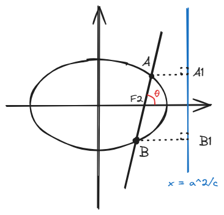

# 结论二：“万能”公式

## 一、结论描述

这是一条可用于所有圆锥曲线的结论，所以名为“万能”。

如图（此处仅画出椭圆），斜率为k的直线穿过右焦点\(F_2 \)，分别在上下交**圆锥曲线**于\(A、B \)两点，且\(\overrightarrow{AF_2} = \lambda \overrightarrow{F_2B} \)，\(\theta \)为直线倾斜角，\(e\)为离心率，则有\(e|\cos \theta | = |\frac{\lambda - 1}{\lambda + 1} | \)。

## 二、结论证明

此处仅以椭圆（水平放置）为例进行证明，其他情况思路类似。

取准线\(x=\frac{a^2}{c}\)，则由离心率和准线性质有：

\[
e = \frac{|AF_2|}{|AA_1|} = \frac{|BF_2|}{|BB_1|} \tag{1} 
\]

又由图中几何关系：

\[
|AF_2|\cos \theta + |BF_2|\cos \theta = |BB_1| - |AA_1| \tag{2}    
\]

将\((2) \)式中的\(|BB_1|\)和\(|AA_1|\)用\((1) \)式替换：

\[
(|AF_2|+|BF_2|)\cos \theta = \frac{|BF_2| - |AF_2|}{e} \tag{3}    
\]

化简并带入\(\lambda \)比例即可得到：

\[
e\cos \theta = \frac{|BF_2| - |AF_2|}{|AF_2|+|BF_2|} = \frac{1 - \lambda}{1 + \lambda} \tag{4}
\]

由于角度和焦点的变化可能产生正负号的问题，所以加上绝对值即为所证结论。

## 三、例题
一斜率为2的直线\(l \)穿过双曲线的左焦点\(F_1\)，与左半束分别在上下相交于\(A\)、\(B\)两点，满足\(\frac{AF_2}{AB} = \frac{1}{3}\)，则该双曲线的离心率为\_\_\_\_\_。