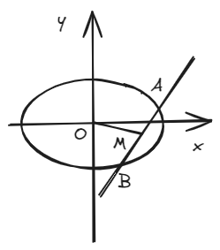
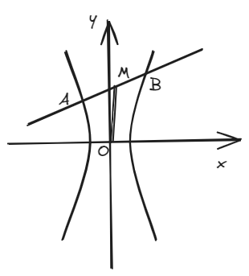
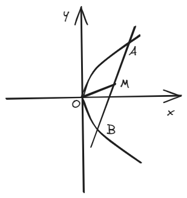
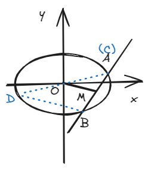

# 结论三：中点弦斜率关系

## 一、结论描述

### 1.椭圆

一直线穿过椭圆交椭圆于相异的\(A\)、\(B\)两点，取\(AB\)中点\(M\)，连接\(OM\)，则:

若焦点在x轴上有：

\[k_{OM} \cdot k_{AB} = -\frac{b^2}{a^2} \]

若焦点在y轴上有：

\[k_{OM} \cdot k_{AB} = -\frac{a^2}{b^2} \]

### 2.双曲线

一直线穿过双曲线交双曲线于相异的\(A\)、\(B\)两点，取\(AB\)中点\(M\)，连接\(OM\)，则:

若焦点在x轴上有：

\[k_{OM} \cdot k_{AB} = \frac{b^2}{a^2} \]

若焦点在y轴上有：

\[k_{OM} \cdot k_{AB} = \frac{a^2}{b^2} \]

### 3.抛物线

一直线穿过抛物线交抛物线于相异的\(A\)、\(B\)两点，取\(AB\)中点\(M (x_0,y_0)\)，则:

若焦点在x轴上有：

\[ |y_0 \cdot k_{AB}| = p\]

若焦点在y轴上有：

\[x_0 \cdot \frac{1}{k_{AB}} \]

## 二、结论证明

核心思路是点差法，这里用水平放置的椭圆为例，其他情况思路类似。 

不妨设\(A(x_1,y_1)\)，\(B(x_2,y_2)\)，因两点都在椭圆上，故有：

\[
\frac{x_1^2}{a^2} + \frac{y_1^2}{b^2} = 1 \tag{1}   
\]

\[
\frac{x_2^2}{a^2} + \frac{y_2^2}{b^2} = 1 \tag{2}   
\]

\((1)\)式减去\((2)\)式得到：

\[
\frac{(x_1-x_2)(x_1+x_2)}{a^2} + \frac{(y_1-y_2)(y_1+y_2)}{b^2} = 0 \tag{3}    
\]

整理后得到：

\[
\frac{y_1-y_2}{x_1-x_2} \cdot \frac{y_1+y_2}{x_1+x_2}= \frac{y_1-y_2}{x_1-x_2} \cdot \frac{\frac{y_1+y_2}{2} - 0}{\frac{x_1+x_2}{2} - 0} = -\frac{b^2}{a^2} \tag{4}
\]

证毕

## 三、例题

(2023·全国乙卷)设\(A\)、\(B\)为双曲线\(x^2 - \frac{y^2}{9} = 1\)上两点，下列四个点中，可为线段\(AB\)中点的是（  ）。

\[
A(1,1) \qquad\quad\qquad B(-1,2) \qquad\quad\qquad C(1,3) \qquad\quad\qquad D(-1,-4)   
\]

（吐槽：这种题放11题，要是秒不掉去笨笨地算肯定浪费时间）

## 四、拓展结论

可以了解一下“椭圆和双曲线的第三定义”，你或许会发现第三定义和结论三的斜率乘积是一样的，那么这之间有什么关系呢？实际上，第三定义也是结论三的推论（见下）的特殊情况。 

### 1.椭圆

\(CD\)为经过原点\(O\)的直线，交椭圆于\(C\)和\(D\)两点，\(B\)为除\(C\)和\(D\)以外的椭圆上的任意一点，则： 

若焦点在x轴上：

\[
k_{BC} \cdot k_{BD} = -\frac{b^2}{a^2}   
\]

若焦点在y轴上：

\[
k_{BC} \cdot k_{BD} = -\frac{a^2}{b^2} 
\]

### 2.双曲线

\(CD\)为经过原点\(O\)的直线，交双曲线于\(C\)和\(D\)两点，\(B\)为除\(C\)和\(D\)以外的双曲线上的任意一点，则： 

若焦点在x轴上：

\[
k_{BC} \cdot k_{BD} = \frac{b^2}{a^2}   
\]

若焦点在y轴上：

\[
k_{BC} \cdot k_{BD} = \frac{a^2}{b^2} 
\]

证明思路其实很简单，下图中的中位线\(BD\)和\(OM\)存在平行关系，即\(k_{BD} = k_{OM}\)

