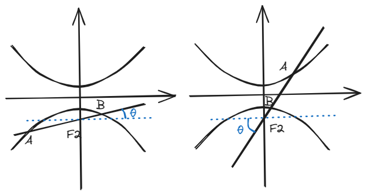

# 结论四：焦半径公式

## 一、结论描述

\[
焦半径长度公式\left\{\begin{matrix}
坐标式 & \\
倾斜角式
\end{matrix}\right.
\]

焦半径指的是**圆锥曲线上一点与其焦点所连的线段**。而焦半径的长度计算公式是一个相当基础的二级结论，可以说掌握了这套公式，就是拿下了很多中档题乃至难题。

### 1.椭圆

#### 1.1 倾斜角式

如图，在椭圆\(\frac{x^2}{a^2} + \frac{y^2}{b^2} = 1 (a>b>0)\)中，过**右**焦点\(F_2\)作倾斜角为\(\theta \)的直线交椭圆于\(A\)和\(B\)，则\(AF_2 = \frac{b^2}{a+c\cos \theta } \)，\(BF_2 = \frac{b^2}{a-c\cos \theta } \) 。

如图，在椭圆\(\frac{x^2}{b^2} + \frac{y^2}{a^2} = 1 (a>b>0)\)中，过**下**焦点\(F_2\)作倾斜角为\(\theta \)的直线交椭圆于\(A\)和\(B\)，则\(AF_2 = \frac{b^2}{a+c\sin \theta } \)，\(BF_2 = \frac{b^2}{a-c\sin \theta } \) 。

\(F_1\)的焦半径长度情况应由对称性质轻易得到。

#### 1.2 坐标式

记忆方法1：脑海里想想谁更长/短，然后把这俩值里面大/小的带进去。

记忆方法2：左加右减，上减下加，这和我们后续的一些规律是一样的。

如图，在椭圆\(\frac{x^2}{a^2} + \frac{y^2}{b^2} = 1 (a>b>0)\)中，\(P(x_0,y_0) \)为椭圆上一点，\(F_1 \)和\(F_2 \)分别为左、右焦点，则\(PF_1 =  a+ex_0\)，\(PF_2 = a-ex_0 \)，其中\(e\)为离心率。

如图，在椭圆\(\frac{x^2}{b^2} + \frac{y^2}{a^2} = 1 (a>b>0)\)中，\(P(x_0,y_0) \)为椭圆上一点，\(F_1 \)和\(F_2 \)分别为上、下焦点，则\(PF_1 =  a-ey_0\)，\(PF_2 = a+ey_0 \)，其中\(e\)为离心率。

### 2.双曲线

#### 2.1 倾斜角式

如图，在双曲线\(\frac{x^2}{a^2} - \frac{y^2}{b^2} = 1\)中，过**右**焦点\(F_2\)作倾斜角为\(\theta \)的直线交椭圆于\(A\)和\(B\)，则\(AF_2 = \frac{b^2}{|a-c\cos \theta| } \)，\(BF_2 = \frac{b^2}{a+c\cos \theta } \) 。

如图，在双曲线\(\frac{y^2}{a^2} - \frac{x^2}{b^2} = 1\)中，过**下**焦点\(F_2\)作倾斜角为\(\theta \)的直线交椭圆于\(A\)和\(B\)，则\(AF_2 = \frac{b^2}{|a-c\sin \theta| } \)，\(BF_2 = \frac{b^2}{a+c\sin \theta } \) 。

\(F_1\)的焦半径长度情况应由对称性质轻易得到。

#### 2.2 坐标式

如图，在双曲线\(\frac{x^2}{a^2} - \frac{y^2}{b^2} = 1 \)中，\(P(x_0,y_0) \)为双曲线上一点，\(F_1 \)和\(F_2 \)分别为左、右焦点，则\(PF_1 =  |a+ex_0|\)，\(PF_2 = |a-ex_0| \)，其中\(e\)为离心率。

如图，在双曲线\(\frac{y^2}{a^2} - \frac{x^2}{b^2} = 1 \)中，\(P(x_0,y_0) \)为双曲线上一点，\(F_1 \)和\(F_2 \)分别为上、下焦点，则\(PF_1 =  |a-ey_0|\)，\(PF_2 = |a+ey_0| \)，其中\(e\)为离心率。

### 3.抛物线

#### 3.1 倾斜角式

如图，在抛物线\(y^2 = 2px (p>0)\)中，过焦点\(F \)作倾斜角为\(\theta \)的直线分别与抛物线上、下相交于\(A \)和\(B \)两点，则\(AF = \frac{p}{1-\cos \theta } \)，\(BF = \frac{p}{1+\cos \theta} \)；在抛物线\(y^2 = -2px (p>0)\)中，过焦点\(F \)作倾斜角为\(\theta \)的直线分别与抛物线上、下相交于\(A \)和\(B \)两点，则\(AF = \frac{p}{1+\cos \theta } \)，\(BF = \frac{p}{1-\cos \theta} \)。

如图，在抛物线\(x^2 = 2py (p>0)\)中，过焦点\(F \)作倾斜角为\(\theta \)的直线分别与抛物线上、下相交于\(A \)和\(B \)两点，则\(AF = \frac{p}{1-\sin \theta } \)，\(BF = \frac{p}{1+\sin \theta} \)；在抛物线\(y^2 = -2px (p>0)\)中，过焦点\(F \)作倾斜角为\(\theta \)的直线分别与抛物线上、下相交于\(A \)和\(B \)两点，则\(AF = \frac{p}{1+\sin \theta } \)，\(BF = \frac{p}{1-\sin \theta} \)。

#### 3.2 坐标式

\(A\)为抛物线上一点，其焦半径为\(AF \)，长度关系如下：

焦点在x轴上时，\(AF = \frac{p}{2} + |x_A|\)

焦点在y轴上时，\(AF = \frac{p}{2} + |y_A|\)

## 二、结论证明

这里就以**焦点在x轴上的椭圆的倾斜角式和坐标式**为例。

**下证倾斜角式**。

由几何关系：

\[
|F_2Q| = |A_1P| = |PA| + |AA_1| \tag{1}
\]

\[
|AF_2|\cdot \cos \theta = |AP| \tag{2}    
\]

由准线和离心率的性质：

\[
\frac{|AF_2|}{|AA_1|} = e \tag{3}  
\]

那么就可以用\((2) \)和\((3) \)式，把\((1) \)式中\(PA\)和\(AA_1\)换成\(AF_2\)，也就是我们的焦半径：

\[
|F_2Q| = |AF_2|\cdot \cos \theta + \frac{1}{e}\cdot |AF_2| \tag{4}
\]

又由坐标关系：

\[
|F_2Q| = \frac{a^2}{c} - c \tag{5}
\]

最后\((4) \)式和\((5) \)式结合得到：

\[
|AF_2|\cdot (\cos \theta + \frac{a}{c}) = \frac{a^2}{c} - c  \tag{6}
\]

化简即可得到：

\[
|AF_2| = \frac{b^2}{a+c\cos \theta }
\]

其他情况不再赘述，思路类似。

**下证坐标式**。

由\((3) \)式可知：

\[
\frac{|AF_2|}{\frac{a^2}{c} - x_A} = \frac{c}{a} \tag{7}
\]

化简即可得到：

\[
|AF_2| = a - ex_A    
\]

其他情况类似，尤其是抛物线，实际上就是定义延伸出来的情况。

## 三、例题

(2017·全国I卷)已知\(F\)为抛物线\(C: y^2 = 4x \)的焦点,过\( F \)作两条互相垂直的直线\(l_1\),\(l_2\), 直线\( l_1 \)与\( C \)交于\( A\)、\(B \)两点,直线\( l_2 \)与\( C \)交于 D、E 两点,则\(|AB|\)+\(|DE|\)的最小值为\(\_\_\_\_\_\_ \)。

(2019·全国I卷)已知椭圆C的焦点\( F_{1} (-1,0) \)，\( F_{2} (1,0) \)，过\( F_{2} \)的直线与C交于A，B两点。若\( |AF_{2}| = 2|F_{2}B| \)，\( |AB| = |BF_{1}| \)，则C的方程为\( \_\_\_\_\_\_\) 。

## 四、拓展结论

以下结论（部分请自行推导）均源自以上公式，记性不好的话记住上面的够用了，考试临场用上面已知的能够推出下面的就行。

**结论1：焦点弦长度公式：** 在上面各种圆锥曲线的倾斜角式的例图中，\(|AB| = \_\_\_\_\_\_ \)

**结论2：焦半径的长度倒数和：** 在上面各种圆锥曲线的倾斜角式的例图中，\(\frac{1}{|AF|} + \frac{1}{|BF|} = \_\_\_\_\_\_ \)

**结论3：互相垂直的两条焦点弦的长度倒数和：** \(AB\)和\(CD\)为互相垂直的两条焦点弦，在椭圆和抛物线中，满足：\(\frac{1}{|AB|} + \frac{1}{|CD|} = |\frac{2-e^2}{2ep} |\)；在双曲线中，左图满足\(\frac{1}{|AB|} + \frac{1}{|CD|} = |\frac{2-e^2}{2ep} |\)，右图满足\(-\frac{1}{|AB|} + \frac{1}{|CD|} = |\frac{2-e^2}{2ep} |\)，其中**p称为焦准距**（焦点到准线的距离，你用a、b和c表示看看？），满足\(p=\frac{b^2}{c} \)。

**结论4：焦点弦长度的最小值：** \(|AB|_{min} = min \{\frac{2b^2}{a},2a \} \)