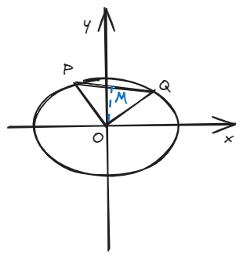
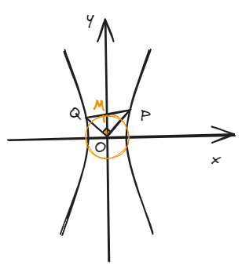
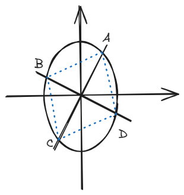

# 结论五：内准圆

## 一、结论描述

### 1.椭圆

\(O\)为坐标原点，\(P\)和\(Q\)是在椭圆上的两个动点，且始终满足\( OP \perp OQ\)，连接PQ，从O向PQ做垂线交于M，则：

\[
|OM| = \frac{ab}{\sqrt{a^2+b^2}} \tag{1}
\]

\[
\frac{1}{|OP|^2} + \frac{1}{|OQ|^2} = \frac{1}{a^2} + \frac{1}{b^2} \tag{2}    
\]

### 2.双曲线

\(O\)为坐标原点，\(P\)和\(Q\)是在双曲线上的两个动点，且始终满足\( OP \perp OQ\)，连接PQ，从O向PQ做垂线交于M，则：（在这种情况下一定有\(b>a\)，可以想想为什么）

\[
|OM| = \frac{ab}{\sqrt{-a^2+b^2}} \tag{3}
\]

\[
\frac{1}{|OP|^2} + \frac{1}{|OQ|^2} = \frac{1}{a^2} - \frac{1}{b^2} \tag{4}    
\]

 说了这么多，那圆在哪儿呢？请看\( (1) \)和\( (3) \)式，\(OM\)的长度是个定值，这个以\(OM\)为半径的圆就是我们的内准圆。

## 二、结论证明

这里就以焦点在x轴上的双曲线为例，设双曲线方程为：

\[
\frac{x^2}{a^2} - \frac{y^2}{b^2} = 1 \tag{5}    
\]

设\( y_{OQ} = kx, y_{OP} = -\frac{1}{k}x \)，将\( OQ \)解析式联立双曲线可得：

\[
( \frac{1}{a^2} - \frac{k^2}{b^2} )x_Q^2 = 1 \tag{6}
\]

又根据\( |OQ| = x_Q \cdot \sqrt{k^2 + 1} \)，得到\(|OQ|^2\)的值：

\[
|OQ|^2 = \frac{k^2 + 1}{\frac{1}{a^2} - \frac{k^2}{b^2} } \tag{7}
\]

同理可以得到\( |OP|^2 \)：

\[
|OP|^2 = \frac{k^2 + 1}{\frac{k^2}{a^2} - \frac{1}{b^2} }  \tag{8}
\]

由\( (7) \)和\( (8) \)式即可求得：

\[
\frac{1}{|OP|^2} + \frac{1}{|OQ|^2} = \frac{1}{a^2} - \frac{1}{b^2} \tag{9}
\]

即\( (4) \)式，又将该式通分并由勾股定理得到：

\[
\frac{1}{|OP|^2} + \frac{1}{|OQ|^2} = \frac{|OP|^2+|OQ|^2}{|OP|^2|OQ|^2} = \frac{|PQ|^2}{|OP|^2|OQ|^2} \tag{10}
\]

由中学阶段所学的射影定理得：

\[
OP^2 = PM \cdot PQ, OQ^2 = QM \cdot PQ \tag{11,12}
\]

\[
OM^2 = PM \cdot QM \tag{13}
\]

先将\( (11) \)和\( (12) \)式带入\( (10) \)式中得到：

\[
\frac{|PQ|^2}{|OP|^2|OQ|^2} = \frac{|PQ|^2}{|PM||PQ|\cdot |QM||PQ|} = \frac{1}{|PM||QM|} \tag{14}
\]

再将\( (13) \)式带入\( (14) \)式得：

\[
\frac{1}{|PM||QM|} = \frac{1}{|OM|^2} \tag{15}
\]

最后\( (10) \)\( (14) \)\( (15) \)连等化简一下就得到：

\[
|OM| = \frac{ab}{\sqrt{-a^2+b^2}}    
\]

得证，证毕

## 三、例题

过椭圆\( \frac{x^2}{4} + \frac{y^2}{9} = 1 \)的中心做两条互相垂直的弦\( AC \)和\( BD \)，顺次连接ABCD得到一个四边形，则该四边形的面积最小值为\( \_\_\_\_\_\_ \)，最大值为\( \_\_\_\_\_\_ \)。

## 四、拓展结论

在上述椭圆中，\( S_{\Delta POQ min} = \frac{a^2b^2}{a^2 + b^2} \)，\( S_{\Delta POQ max} = \frac{ab}{2} \)。

在上述双曲线中，\( S_{\Delta POQ max}\)不存在，\( S_{\Delta POQ min} = \frac{a^2 b^2}{b^2 - a^2} \)。

（实际上，这个结论可以解决，甚至说，秒杀上述例题————这正是积累二级结论丰富的好处，这道题作为一道填空压轴或轴题，不知玄妙的苦行僧埋头苦算，而智者早已越万重山！）

证明：此处证明以椭圆为例，因双曲线只有最小值一种情况，思路和椭圆接近，故不赘述。

下证**最小值**。

由底乘高的面积公式可得：

\[
S = \frac{1}{2} \cdot |OM| \cdot |PQ| = \frac{1}{2} \cdot \frac{ab}{\sqrt{a^2+b^2}} \cdot (|PM| + |MQ|) \tag{16}
\]

由均值不等式可得：

\[
\frac{1}{2} \cdot \frac{ab}{\sqrt{a^2+b^2}} \cdot (|PM| + |MQ|) \ge \frac{1}{2} \cdot \frac{ab}{\sqrt{a^2+b^2}} \cdot ( 2 \sqrt{|PM||MQ|}) \tag{17}
\]

当\( |PM| = |PQ| \)时取等。

又将\( (13) \)式带入\( (17) \)式即可得到：

\[
S \ge \frac{a^2b^2}{a^2 + b^2}
\]

得证最小值，下证**最大值**（下面的操作也可以解决最小值，上面只是给个其他思路）。

由\( (12) \)和\( (16) \)式可得：

\[
S = \frac{1}{2} |OM| (|PM| + \frac{|OM|^2}{|PM|} ) \tag{18}
\]

根据“双钩”函数性质，在\( |PM| \)和\( |OM| \)取最大差值的地方可以取到最大值，而当\( |PM| = |OM| \)时取最小值。

由勾股定理得：

\[
|PM|^2 = |OP|^2 - |OM|^2 \tag{19}    
\]

因\( |OM| \)为定值，所以当\( |OP| \)最大的时候就是\( |PM| \)最大的时候，此时也是和\( |OM| \)差值最大的时候（最小的时候已经知道了就是取等，所以这个取值范围不用担心），而\( |OP| \)最大值为\( a \)，此时可得：

\[
S \le \frac{1}{2} ab
\]

得证，证毕。