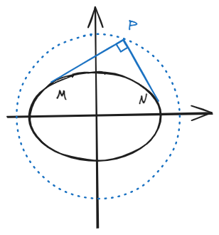
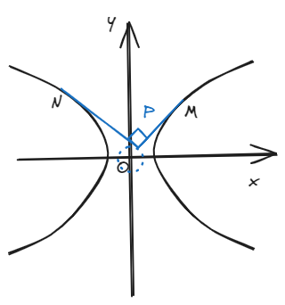

# 结论六：外准圆

## 一、结论描述

有内准圆当然有外准圆，这二者其实有点联系，但是此处不多说，毕竟也不是啥考点，如有兴趣请自行查阅。

其定义阐述为：过双曲线或椭圆外一点作两条**互相垂直的切线**，那么这一点的轨迹是一个圆，这个圆其实就是外准圆。

外准圆由蒙日发明，我记得是个法国的高级军官，所以外准圆又称“蒙日圆”。

### 1.椭圆

椭圆情况下的蒙日圆解析式满足：

\[
x^2 + y^2 = a^2 + b^2 \tag{1}   
\]

### 2.双曲线

双曲线情况下的蒙日圆解析式满足：（这里也要求\( a > b \)）

\[
x^2 + y^2 = a^2 - b^2 \tag{2}
\]

## 二、结论证明

这个结论推起来很繁杂，我当时笔记本上自己推导的时候写了一大块草稿纸，~~这里空间太小我写不下（谁家费马？）~~ 但是推导思路多样而且大多都很简单，我大致阐述一下目前高中常见且可行的普通思路，有兴趣可自行证明。

先设圆锥曲线外一点\(P(x_0,y_0)\)，设过P点做圆锥曲线的切线\( (y-y_0) = k(x-x_0) \)，这条线既能代表\(PM\)，也能代表\( PN \)；

接下来联立该直线方程和圆锥曲线得到关于\(x\)的，带\(k\)、\(x_0\)和\(y_0\)为参数的一元二次方程，而根据这是切线，所以\( \Delta_x = 0 \)；

最后由\(\Delta_x = 0\)得到关于\(k\)的，以\(x_0\)和\(y_0\)为参数的一元二次方程，而根据俩切线垂直，所以\(k_{PM} \cdot k_{PN} = -1\)，结合韦达定理就可以得到最终蒙日圆的解析式了。

## 三、例题

P是平面内一动点，过P向椭圆\(\frac{x^2}{9} + \frac{y^2}{7} = 1 \)做两条切线\(PM\)和\(PN\)，恰好满足\(PM \perp PN \)，求P到直线\(y = -4x + 16 \)的最大值和最小值分别为\( \_\_\_\_\_\_ \)。

P为平面内的一动点，过P向椭圆\(\frac{x^2}{9} + \frac{y^2}{4} = 1 \)做两条切线\(PM\)和\(PN\)，且满足\(PM \perp PN \)，求\( S_{\Delta PMN} \)最小值。

（吐槽：这分别是近几年的某市模拟题和敝校的一张练习卷子上的题目，我只改了下数据，蒙日圆这玩意儿我记得在刷1x年的题的时候貌似偶尔有考查，为了防止“某些题目在新高考里死灰复燃”，所以还是有必要掌握这结论的。不懂这结论的人做到这俩题就有难了，光是推导出\(P\)的轨迹都累死个人......）

## 四、拓展结论

蒙日圆里有些稀奇古怪的推论，全国卷应该不会考太阴间，主要还是考硬算基本功，这里就举个我碰到过的推论吧。

**结论：**\(OP\)平分\(AB\)。也就是说若设\(OP\)与\(AB\)交于\(Q\)，那么点\(Q\)为\(AB\)中点（这里也可以联系到结论三）。

这个的证明写起来还是很繁杂，就不多写了，可以说在考场上记住**二、结论证明**部分的大致流程就行了，如果是大题就假装写几步最后直接得到结论。