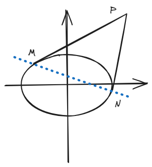
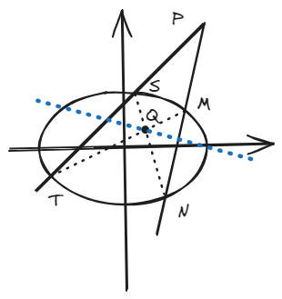
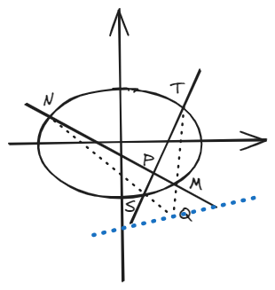
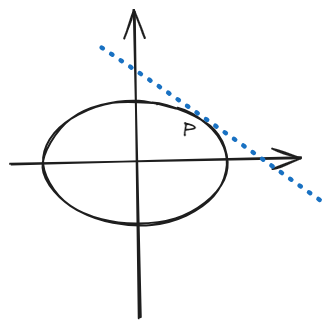
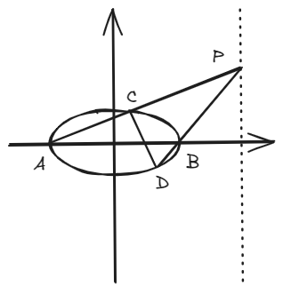

# 结论七：极点与极线

!!! abstract
    极点极线给出了填选题中轨迹的重要解题方法，即根据一个点和“简单的描述”直接得到相应的轨迹。

## 一、结论描述

### 1.定义

已知曲线：\( Ax^2 + By^2 + Cx + Dy + E = 0 \)（其中\(ABCDE\)均为常数），若记平面内\( P(x_0,y_0) \)为极点，则极线\( Ax_0x + By_0y + C\frac{x+x_0}{2} +D\frac{y+y_0}{2} + E  = 0 \)

### 2.结论

其实总共就四种情况：

对于一圆锥曲线，\( P(x_0,y_0) \)为曲线**外**一点，过\( P \)点任意作圆锥曲线的两条切线，设切点分别为\( M \)和\( N \)，则\( MN \)为极线，其解析式为：\( Ax_0x + By_0y + C\frac{x+x_0}{2} +D\frac{y+y_0}{2} + E  = 0 \)。

对于一圆锥曲线，\( P(x_0,y_0) \)为曲线**外**一点，过\( P \)点任意作圆锥曲线的两条割线，设割线分别交于\( S \)、\( T \)、\( M \)和\( N \)点（见图），连接\( MT \)和\( NS \)，设两连线交于\( Q \)，则\( Q \)的轨迹为极线，其解析式为：\( Ax_0x + By_0y + C\frac{x+x_0}{2} +D\frac{y+y_0}{2} + E  = 0 \)。

对于一圆锥曲线，\( P(x_0,y_0) \)为曲线**内**一点，过\( P \)点任意作圆锥曲线的两条割线，设割线分别交于\( S \)、\( T \)、\( M \)和\( N \)点（见图），连接\( MT \)和\( NS \)，设两连线交于\( Q \)，则\( Q \)的轨迹为极线，其解析式为：\( Ax_0x + By_0y + C\frac{x+x_0}{2} +D\frac{y+y_0}{2} + E  = 0 \)。

对于一圆锥曲线，\( P(x_0,y_0) \)为曲线**上**一点，过\( P \)点作圆锥曲线的切线，则该切线为极线，其解析式为：\( Ax_0x + By_0y + C\frac{x+x_0}{2} +D\frac{y+y_0}{2} + E  = 0 \)。

## 二、结论证明

!!! tip
    这个结论一般用于填空选择题，而且不同情况也不好证明，所以这里就不证明了。

## 三、例题

(2020·全国Ⅰ卷)\(A,B\)为椭圆\(E: \frac{x^2}{9}+y^2=1\)的左右顶点，\(P\)为直线 
\(x = 6\)的动点，\(PA\)、\(PB \)分别与\(E\)交于\(C\)、\(D\)（异于\(A\),\(B\)点），证明：直线 CD 过定点.

!!! tip
    这道题具体做法我就不阐述了，主要是可以**用极点极线提前确定定点**，由此进行倒推，比无脑去猜定点位置要靠谱得多。

    思路：设\( P(6,x_0) \)，则可以得知\(P\)的极线为\( \frac{6\cdot x}{9} + 0\cdot y = 1 \)，即\( x = \frac{3}{2} \)，又根据对称性，\(P\)点在上在下肯定穿过的是x轴上的定点，那就直接知道了定点\( (\frac{3}{2},0) \)，后续做题就是流水线，韦达联立（不用计算），几步出答案。
