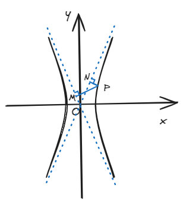

# 结论八：双曲线上一点到两渐近线距离之积

!!! abstract
    这是一个相当简单的结论，只需要得有个大致印象：**双曲线上一点到两渐近线的距离乘积为定值**\( \frac{a^2b^2}{c^2} \)。

## 一、结论描述

设\( P \)为双曲线上一点，由\( P \)向两条渐近线作垂线段，其长度分别记为\( d_1 \)和\( d_2 \)，则\( d_1 \cdot d_2 = \frac{a^2b^2}{c^2} \)

## 二、结论证明

证明：此处以焦点在x轴上为例，焦点在y轴上是一样的思路。

不妨假设\( P(x_0,y_0) \)，双曲线为\( \frac{x^2}{a^2} - \frac{y^2}{b^2} = 1 \)，渐近线\( y = \pm \frac{b}{a}x \)，则有距离公式：

\[ |PM| = \frac{|bx_0-ay_0|}{\sqrt{a^2 + b^2}} = d_1 \tag{1} \]

\[ |PN| = \frac{|bx_0+ay_0|}{\sqrt{a^2 + b^2}} = d_1 \tag{2} \]

由\( (1) \)和\( (2) \)式相乘：

\[
d_1 \cdot d_2 = \frac{b^2x_0^2-a^2y_0^2}{c^2} \tag{3}
\]

又\( P(x_0,y_0) \)在双曲线上，所以有：

\[
\frac{x_0^2}{a^2} - \frac{y_0^2}{b^2} = 1 \tag{4}
\]

\((4)\)带入\((3) \)式可得：

\[
d_1 \cdot d_2 = \frac{a^2b^2}{c^2}
\]

证毕。

## 三、例题

双曲线\( E:x^2-\frac{y^2}{3} = 1 \)，\(P\)为双曲线上一点，过P点作两渐近线的垂线段分别交于\( M \)和\( N \)，若\(|PM| = \frac{1}{3} \)，则\(|PM| = \_\_\_\_\_\_ \)，\(|MN| = \_\_\_\_\_\_ \)。