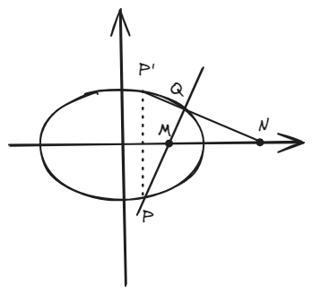
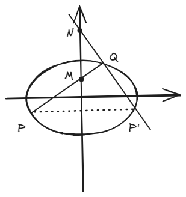
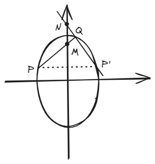

# 结论九：伴侣点

!!! abstract
    这结论描述起来挺复杂，但是实际上是个简单的结论，最终都会回到“\( x_m \cdot x_n = \space \)所在半轴长度的平方”。

## 一、结论描述

!!! note
    下面对这个结论的所有情况有详细描述，但是实际上这个结论是“触类旁通”的，不需要过多记忆，知道其中一种就能知道所有。

### 1.椭圆

#### 1.1 焦点在x轴上

在椭圆\(\frac{x^2}{a^2} + \frac{y^2}{b^2} = 1 \space (a>b>0) \)中，

若\(M(x_m,0) \)是x轴上位于椭圆**内**的一点，过\( M \)作任意直线\( PQ \)交椭圆于\( P \)和\( Q \)两点，\( P \)关于x轴对称点\( P' \)，连接\( P'Q \)交x轴于\( N(x_n,0)  \)，则有：\( x_m \cdot x_n = a^2  \)。

若\( N(x_n,0)  \)是x轴上位于椭圆**外**的一点，过\( N \)作直线\( P'Q \)交椭圆于不重合的\( P' \)和\( Q \)两点，\( P' \)关于x轴对称点\( P \)，连接\( PQ \)交x轴于\(M(x_m,0) \)，则有：\( x_m \cdot x_n = a^2  \)。

若\(M(0,y_m) \)是y轴上位于椭圆**内**的一点，过\( M \)作任意直线\( PQ \)交椭圆于\( P \)和\( Q \)两点，\( P \)关于y轴对称点\( P' \)，连接\( P'Q \)交y轴于\( N(0,y_n)  \)，则有：\( y_m \cdot y_n = b^2  \)。

若\( N(0,y_n)  \)是y轴上位于椭圆**外**的一点，过\( N \)作直线\( P'Q \)交椭圆于不重合的\( P' \)和\( Q \)两点，\( P' \)关于y轴对称点\( P \)，连接\( PQ \)交y轴于\(M(0,y_m) \)，则有：\( y_m \cdot y_n = b^2  \)。

#### 1.2 焦点在y轴上

在椭圆\(\frac{x^2}{b^2} + \frac{y^2}{a^2} = 1 \space (a>b>0) \)中，

若\(M(x_m,0) \)是x轴上位于椭圆**内**的一点，过\( M \)作任意直线\( PQ \)交椭圆于\( P \)和\( Q \)两点，\( P \)关于x轴对称点\( P' \)，连接\( P'Q \)交x轴于\( N(x_n,0)  \)，则有：\( x_m \cdot x_n = b^2  \)。

若\( N(x_n,0)  \)是x轴上位于椭圆**外**的一点，过\( N \)作直线\( P'Q \)交椭圆于不重合的\( P' \)和\( Q \)两点，\( P' \)关于x轴对称点\( P \)，连接\( PQ \)交x轴于\(M(x_m,0) \)，则有：\( x_m \cdot x_n = b^2  \)。

若\(M(0,y_m) \)是y轴上位于椭圆**内**的一点，过\( M \)作任意直线\( PQ \)交椭圆于\( P \)和\( Q \)两点，\( P \)关于y轴对称点\( P' \)，连接\( P'Q \)交y轴于\( N(0,y_n)  \)，则有：\( y_m \cdot y_n = a^2  \)。

若\( N(0,y_n)  \)是y轴上位于椭圆**外**的一点，过\( N \)作直线\( P'Q \)交椭圆于不重合的\( P' \)和\( Q \)两点，\( P' \)关于y轴对称点\( P \)，连接\( PQ \)交y轴于\(M(0,y_m) \)，则有：\( y_m \cdot y_n = a^2  \)。

## 二、结论证明

## 三、例题

## 四、拓展结论