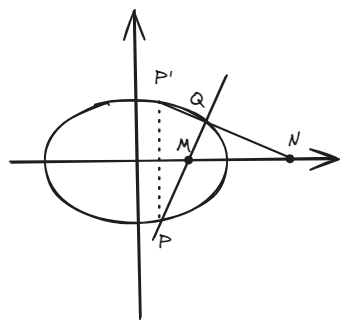
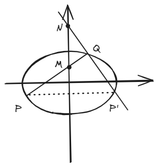
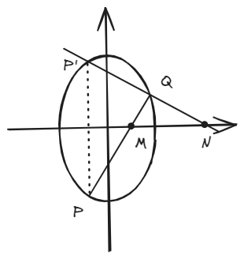
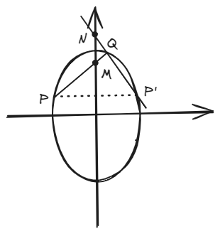
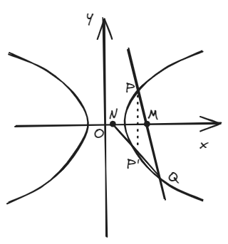
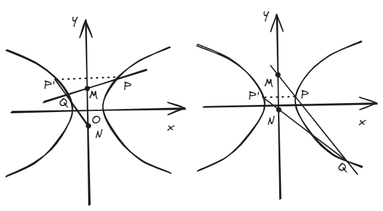
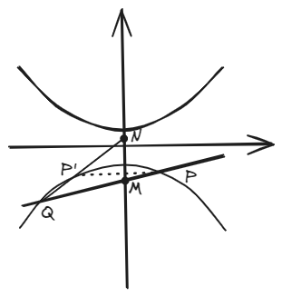
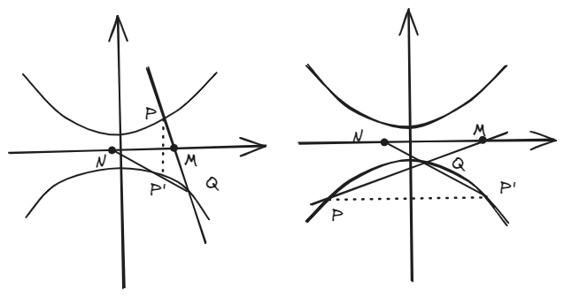
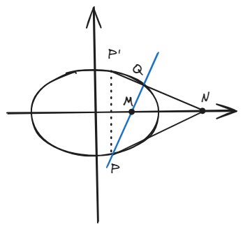
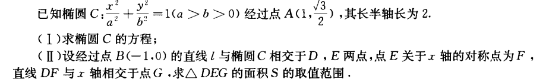

# 结论九：伴侣点

??? abstract
    这结论描述起来挺复杂，但是实际上是个简单的结论，最终都会回到“ \( x_m \cdot x_n = \space \)所在半轴长度\(^2\space \) ”。

## 一、结论描述

??? note
    下面对这个结论的所有情况有详细描述，但是实际上这个结论是“触类旁通”的，不需要过多记忆，知道其中一种就能知道所有。

### 1.椭圆

#### 1.1 焦点在x轴上

在椭圆\(\frac{x^2}{a^2} + \frac{y^2}{b^2} = 1 \space (a>b>0) \)中，

若\(M(x_m,0) \)是x轴上位于椭圆**内**的一点，过\( M \)作任意直线\( PQ \)交椭圆于\( P \)和\( Q \)两点，\( P \)关于x轴对称点\( P' \)，连接\( P'Q \)交x轴于\( N(x_n,0)  \)，则有：\( x_m \cdot x_n = a^2  \)。

若\( N(x_n,0)  \)是x轴上位于椭圆**外**的一点，过\( N \)作直线\( P'Q \)交椭圆于不重合的\( P' \)和\( Q \)两点，\( P' \)关于x轴对称点\( P \)，连接\( PQ \)交x轴于\(M(x_m,0) \)，则有：\( x_m \cdot x_n = a^2  \)。

若\(M(0,y_m) \)是y轴上位于椭圆**内**的一点，过\( M \)作任意直线\( PQ \)交椭圆于\( P \)和\( Q \)两点，\( P \)关于y轴对称点\( P' \)，连接\( P'Q \)交y轴于\( N(0,y_n)  \)，则有：\( y_m \cdot y_n = b^2  \)。

若\( N(0,y_n)  \)是y轴上位于椭圆**外**的一点，过\( N \)作直线\( P'Q \)交椭圆于不重合的\( P' \)和\( Q \)两点，\( P' \)关于y轴对称点\( P \)，连接\( PQ \)交y轴于\(M(0,y_m) \)，则有：\( y_m \cdot y_n = b^2  \)。

#### 1.2 焦点在y轴上

在椭圆\(\frac{x^2}{b^2} + \frac{y^2}{a^2} = 1 \space (a>b>0) \)中，

若\(M(x_m,0) \)是x轴上位于椭圆**内**的一点，过\( M \)作任意直线\( PQ \)交椭圆于\( P \)和\( Q \)两点，\( P \)关于x轴对称点\( P' \)，连接\( P'Q \)交x轴于\( N(x_n,0)  \)，则有：\( x_m \cdot x_n = b^2  \)。

若\( N(x_n,0)  \)是x轴上位于椭圆**外**的一点，过\( N \)作直线\( P'Q \)交椭圆于不重合的\( P' \)和\( Q \)两点，\( P' \)关于x轴对称点\( P \)，连接\( PQ \)交x轴于\(M(x_m,0) \)，则有：\( x_m \cdot x_n = b^2  \)。

若\(M(0,y_m) \)是y轴上位于椭圆**内**的一点，过\( M \)作任意直线\( PQ \)交椭圆于\( P \)和\( Q \)两点，\( P \)关于y轴对称点\( P' \)，连接\( P'Q \)交y轴于\( N(0,y_n)  \)，则有：\( y_m \cdot y_n = a^2  \)。

若\( N(0,y_n)  \)是y轴上位于椭圆**外**的一点，过\( N \)作直线\( P'Q \)交椭圆于不重合的\( P' \)和\( Q \)两点，\( P' \)关于y轴对称点\( P \)，连接\( PQ \)交y轴于\(M(0,y_m) \)，则有：\( y_m \cdot y_n = a^2  \)。

### 2.双曲线

#### 1.1 焦点在x轴上

在双曲线\(\frac{x^2}{a^2} - \frac{y^2}{b^2} = 1 \)中，

若\(M(x_m,0) \)是x轴上位于双曲线**内**的一点，过\( M \)作任意直线\( PQ \)交双曲线于\( P \)和\( Q \)两点，\( P \)关于x轴对称点\( P' \)，连接\( P'Q \)交x轴于\( N(x_n,0)  \)，则有：\( x_m \cdot x_n = a^2  \)。

若\( N(x_n,0)  \)是x轴上位于双曲线**外**的一点，过\( N \)作直线\( P'Q \)交双曲线于不重合的\( P' \)和\( Q \)两点，\( P' \)关于x轴对称点\( P \)，连接\( PQ \)交x轴于\(M(x_m,0) \)，则有：\( x_m \cdot x_n = a^2  \)。

若\(M(0,y_m) \)是y轴上一点，过\( M \)作任意直线\( PQ \)交双曲线于\( P \)和\( Q \)两点，\( P \)关于y轴对称点\( P' \)，连接\( P'Q \)交y轴于\( N(0,y_n)  \)，则有：\( y_m \cdot y_n = -b^2  \)。

??? note
    上述描述其实有直线交于同一支或两支的情况，但都是一样的。

#### 1.2 焦点在y轴上

在双曲线\(\frac{y^2}{a^2} - \frac{x^2}{b^2} = 1 \)中，

若\(M(0,y_m) \)是y轴上位于双曲线**内**的一点，过\( M \)作任意直线\( PQ \)交双曲线于\( P \)和\( Q \)两点，\( P \)关于y轴对称点\( P' \)，连接\( P'Q \)交y轴于\( N(0,y_n)  \)，则有：\( y_m \cdot y_n = a^2  \)。

若\( N(0,y_n)  \)是y轴上位于双曲线**外**的一点，过\( N \)作直线\( P'Q \)交双曲线于不重合的\( P' \)和\( Q \)两点，\( P' \)关于y轴对称点\( P \)，连接\( PQ \)交y轴于\(M(0,y_m) \)，则有：\( y_m \cdot y_n = a^2  \)。

若\(M(x_m,0) \)是x轴上一点，过\( M \)作任意直线\( PQ \)交双曲线于\( P \)和\( Q \)两点，\( P \)关于x轴对称点\( P' \)，连接\( P'Q \)交x轴于\( N(x_n,0)  \)，则有：\( x_m \cdot x_n = -b^2  \)。

??? note
    和焦点在y轴上的双曲线类似，上述在x轴上的情况其实也有直线交于同一支或不同的两支的情况，但都是一样的。

## 二、结论证明

??? note
    证法主要有两种，第一种是直接设直线和点坐标，力大砖飞；第二种是用**坐标变换**的方法，即将定点作为新的坐标系原点进行运算。
    
    后续笔记会详细讲解第二种思路，所以这里先用第一种思路证明，此处选取**焦点在x轴上并且椭圆外x轴上的N点为定点**的情况进行证明。

证明：

设\( N(n,0) \)，\( PQ:x = ky + t \)，椭圆\( E:\frac{x^2}{a^2} + \frac{y^2}{b^2} = 1\space (a>b>0) \)，则：

由对称性质有：

\[
k_{PN} + k_{QN} = 0 \tag{1}
\]

带入一下可得：

\[
\frac{y_1}{x_1-n} + \frac{y_2}{x_2-n} = 0 \tag{2}
\]

通分并带入韦达定理化简得：

\[
\frac{-2a^2b^2k + 2b^2ktn}{a^2 + b^2k^2} = 0 \tag{3}
\]

即：

\[ 
nt = a^2 \tag{4}
\]

而根据直线\(PQ\)方程，显然\(t\)是\( M \)的横坐标，得证。

## 三、例题

??? tip
    上面这道题就是2021年的成都二诊。

    首先，第1小问易得方程\( C:\frac{x^2}{4} + \frac{y^2}{3} = 1 \)。
    
    这里的第2小问其实有两种做法，一种是用韦达定理硬算，步骤偏少；而这里使用结论九的思路计算更简单，但在书写过程中会有更多步骤。

    由结论九可得：\( G(-4,0) \)，此时再求\( S_{\Delta DEG}\)就变成简单的面积计算问题了。